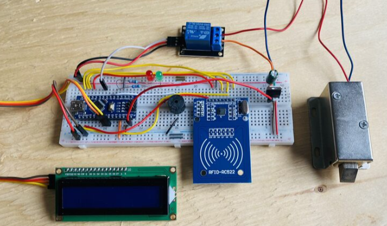

# RFID-Based Smart Door Access Control System

## Overview
This project is a smart access control system developed using Arduino Nano and RFID technology. The system authenticates users through RFID cards and controls door access.

## Project Image

## Features
- RFID card authentication
- Secure access control
- LCD status display
- Buzzer alerts
- Unauthorized access detection

## Components Used
- Arduino Nano
- RFID RC522 Reader
- LCD Display
- Buzzer
- Relay Module
- Electromagnetic Door Lock

## Technologies
- Arduino IDE
- Embedded C/C++
- SPI Communication
- I2C Communication
